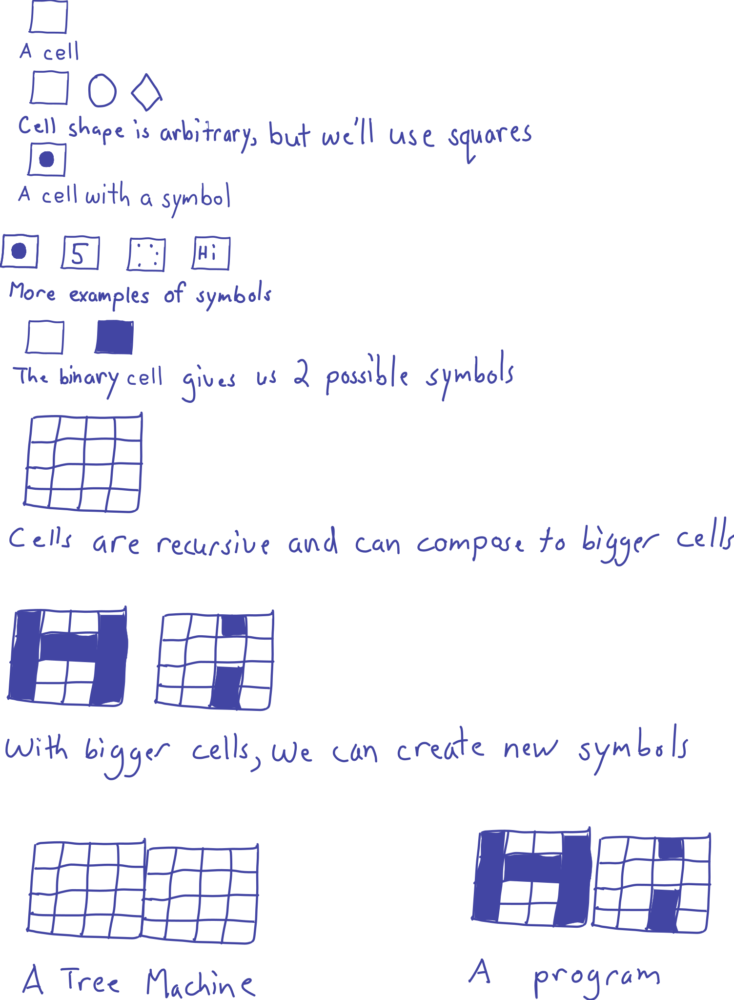

# Liber Simplicitas

[View on GitHub](https://github.com/treenotation/blog.treenotation.org/blob/master/liber-simplicitas.md)

## WORK IN PROGRESS.

The Tree Notation system of writing consists of _cells_ and _symbols_ and _cellSizes_ and _trees_ and _treeMachines_ and _programs_ and _grammars_.

A cell contains a symbol. A symbol can have many forms, but can always be reduced to a simple number.

A cell has a finite number of possible symbols it could contain. A cell can only contain one symbol at a time.

A symbol could be a dot, or a number, or even a long word. The word "word" is sometimes used interchangeably for symbol.

Tree Notation is recursive. You can expand the domain of a cell by merging cells into a bigger cell. Cells have a cellSize. The cellSize is limited to the hardware, or in the software realm can be virtually unlimited.

The most basic cell is the binary cell. It has 1 bit of information.

By combining cells to increase the cellSize, you can define new symbols.

Cells can be combined horizontally and/or vertically.

A Tree consists of a line of cells and/or a plane of child Trees.

A TreeMachine is a physical system that can hold the contents of the Tree. A grid of transistors or lightbulbs or a piece of papyrus are all valid TreeMachines. A machine may or may not have computing abilities.

A program is the symbol values of the Tree in the Machine.

A Machine has physical limitations on the programs it can contain. If a program cannot physically be represented on some Machine it is not a valid program for that machine.

Grammars can put further artificial restrictions on what programs are invalid, even if it were a valid program on a machine.

Tree Notation can be represented in 1-dimensions by defining 3 symbols:

- the nodeBreakSymbol, by convention the newline
- the wordBreakSymbol, by convention the space
- the edgeSymbol, by convention the space

Using just these rules of notation, or syntax, all languages, from the simplest to the most complex, can be built in a straightforward manner.

