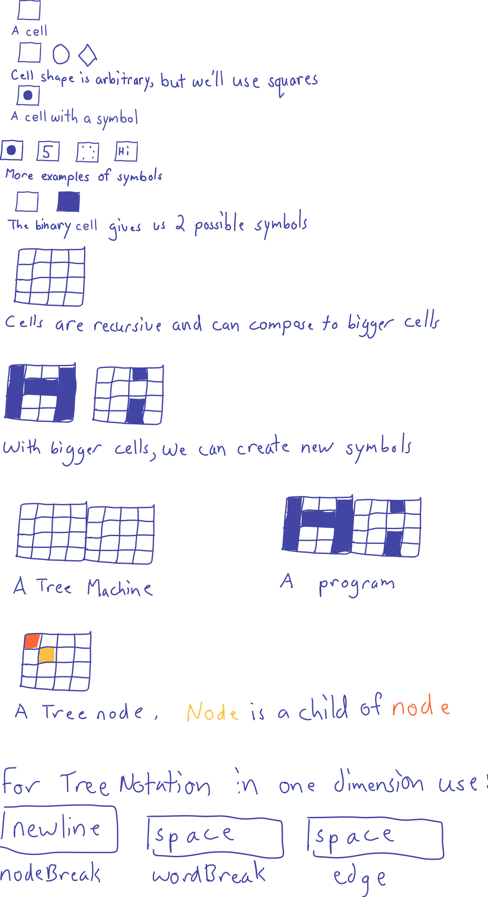

# Liber Simplicitas

[View on GitHub](https://github.com/treenotation/blog.treenotation.org/blob/master/liber-simplicitas.md)

The Tree Notation system of writing consists of _cells_ and _symbols_ and _cellSizes_ and _trees_ and _treeMachines_ and _programs_ and _grammars_.

A cell contains a symbol. A symbol can have many forms, but can always be reduced to a simple number.

A cell has a finite number of possible symbols it could contain. A cell can only contain one symbol at a time.

A symbol could be a dot, or a number, or even a long word. The word "word" is sometimes used interchangeably for symbol.

Cells have a cellSize and are recursive. You can expand the domain of a cell by increasing or decreasing the cellSize. The cellSize can be measured in bits. The most basic cell is the binary cell. It has 1 bit of information.

Tree Notation is a 2-dimensional notation. Cells have a height and a width. The smallest cellSize is 1 bit tall and 1 bit wide. A traditional 1-D 8-bit register can be thought of as 1 bit tall by 8 bits wide.

An engineer can define the cellSize. The engineer can design their machine to combine 64 bits into an 8 by 8 square register for a cellSize of 8x8. The cellSize is limited to the hardware, or in the software realm with a software defined cell delimiter cellSize can be virtually unlimited.

By increasing the cellSize, you can define new symbols. Because you can define cellSizes with a height and a width, theoretically you could create 2-D registers and have encodings that replace encodings like UTF-8 where the letter "A" would look like the letter A if you had a powerful microscope that could zoom in on the registers in a cpu.

A Tree is a tuple consisting of an array of cells (aka a "line") and/or an array of child Trees. Cells do not contain a notion of parents or children or a line of cells. When you add those concepts you get Trees.

A TreeMachine is a physical system that can hold the contents of the Tree. A grid of transistors or lightbulbs or a piece of papyrus are all valid TreeMachines. A machine may or may not have computing abilities.

A program is the symbol values of the Tree in the Machine.

A Machine has physical limitations on the programs it can contain. If a program cannot physically be represented on some Machine it is not a valid program for that machine.

Grammars can put further artificial restrictions on what programs are invalid, even if it were a valid program on a machine.

Tree Notation can be represented in 1-dimension by defining 3 symbols:

- the nodeBreakSymbol (seperates nodes, aka lines), by convention the newline
- the wordBreakSymbol, by convention the space
- the edgeSymbol, by convention the space

Using just these rules of notation, or syntax, all languages, from the simplest to the most complex, can be built in a straightforward manner.

Tree Notation is one specific member in a larger general class of "spatial notations" which we do not define here but may discuss later.

